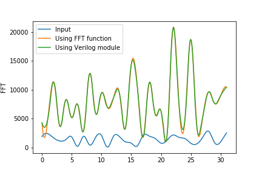

# Fast Fourier Transform using Cooley-Tukey Algorithm
A 32 point radix-2 FFT module written in Verilog


Clone this repo
```
git clone https://github.com/AugustinJose1221/FFTx32.git
```

Change directory
```
cd FFTx32/src
```

iverilog Installation
```
sudo apt-get install iverilog
```

Run program
```
iverilog -o main FFT.v MyTestbed.v FFTtb.v
vvp main
```
This creates a <b><i>main.vcd</i></b> file in the same directory.
To do simulation of the program, you have to install gtkwave

gtkwave Installation
```
sudo apt-get install gtkwave
```

Run simulation
```
gtkwave main.vcd
```

<h3>Simulation Output</h3>
   </img>
  <br>
  <br>
  <h3>Output Fourier Transform</h3>
   Our Verilog FFT module in comparison with FFT function in Python. The output is ploted using matplotlib</img>
